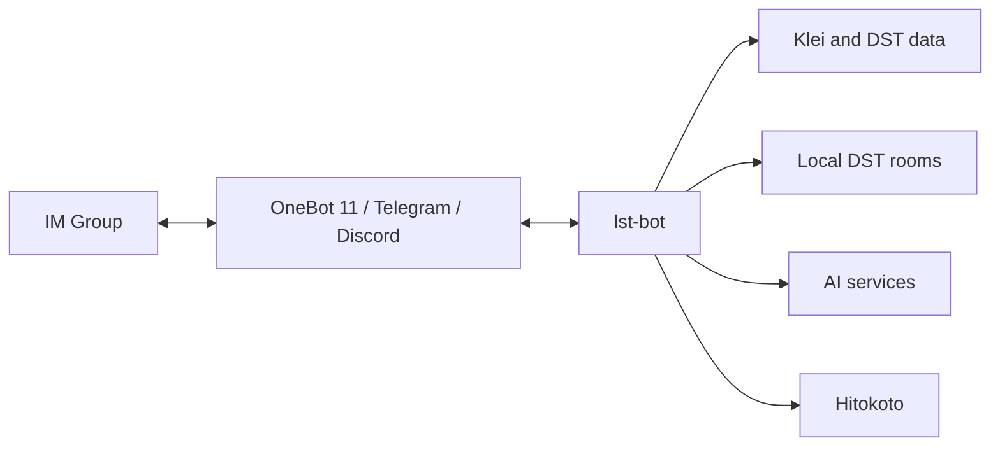

# lst-bot

English | [简体中文](README.zh-Hans.md)

`lst-bot` is the IM bot for **Let's Starve Together (LST)**, a *Don't Starve Together (DST)* player community.

This repository contains the bot application and its reusable framework and client packages.

## Features

- Connects chats through OneBot 11, Telegram, and Discord.
- Looks up DST versions, Klei lobbies, and room details.
- Manages local DST rooms and sends scheduled activity reports.
- Answers DST questions with an AI agent.

## Architecture

## Layout

- `src/lst_bot/` contains the application.
- `pkgs/` contains the bot framework and service clients.
- `systemd/` contains the deployment units.
- Tests live beside the code they cover.

## Configuration

The app reads `.env` from the repository root.

| Name | Purpose |
| --- | --- |
| `ONEBOT_WS_URL` | OneBot 11 WebSocket URL |
| `ONEBOT_ACCESS_TOKEN` | OneBot 11 access token |
| `ONEBOT_SELF_ID` | OneBot 11 account ID |
| `TELEGRAM_BOT_TOKEN` | Telegram Bot API token; empty disables Telegram |
| `DISCORD_BOT_TOKEN` | Discord bot token; empty disables Discord |
| `DISCORD_INTENTS` | Discord Gateway intent bitfield; defaults to `4609` |
| `BOT_ADMIN` | Admin IDs grouped by platform, for example `{"qq":["123"]}` |
| `BOT_CMD_PREFIXES` | Command prefixes |
| `BOT_TIMEOUT` | Event handling timeout as an ISO 8601 duration |
| `BOT_TIMEZONE` | Scheduler timezone |
| `REPORT_GROUP_ID` | OneBot 11 report group; empty disables scheduled reports |
| `KLEI_ACCESS_TOKEN` | Klei access token |
| `KLEI_HOST_ID` | Managed DST host ID |
| `OPENROUTER_API_KEY` | Required AI provider credentials |
| `DOSU_MCP_ENDPOINT` | Required HTTPS knowledge service endpoint |
| `DOSU_API_KEY` | Required knowledge service credentials |
| `HTTP_PROXY` | HTTP proxy for external services and Telegram/Discord traffic, including the Discord Gateway; empty connects directly |
| `LOG_LEVEL` | Log level |

`ONEBOT_WS_URL` and `ONEBOT_SELF_ID` must be set together; leaving both empty disables OneBot 11.

Telegram receives events with the official `getUpdates` long poll because the Bot API has no WebSocket transport.

Discord uses a WebSocket Gateway.
Enable every configured privileged intent in the Discord Developer Portal; reading ordinary guild message content requires `MESSAGE_CONTENT` (`DISCORD_INTENTS=37377` with the defaults).

## Platform APIs

Official QQ Bot API support is available in the reusable `bot` framework; the `lst-bot` application does not configure that gateway.

Telegram exposes Bot API methods by their official names, except `getUpdates` and `setWebhook`, which conflict with its long poll.

Discord exposes common bot actions plus `discord.request` and `discord.gateway`; user OAuth, voice transport, and multi-process shard coordination are out of scope.
A single `DiscordGateway` owns one shard; bots at Discord's mandatory large-scale sharding threshold need an external shard coordinator.

## Development

- `just sync` installs the workspace and development hooks.
- `just dev` starts the bot.
- `just check` runs CI checks.
- `just test` formats, lints, type-checks, and runs the test suite.
- `just build` checks and builds the project.

## Deployment

The supplied systemd units use `/srv/lst-bot`; the optional OneBot 11 deployment also uses `/srv/napcat`.

`systemd/napcat.container` runs NapCat with Podman when OneBot 11 is enabled.

1. Place the repository at `/srv/lst-bot` and run `just sync`.
2. Configure `.env`.
3. Enable the bot service and, when using OneBot 11, the NapCat container.
4. For room management, provide `dst@<room>.service` units and grant the bot permission to control them.

Update the systemd units if the deployment paths differ.
