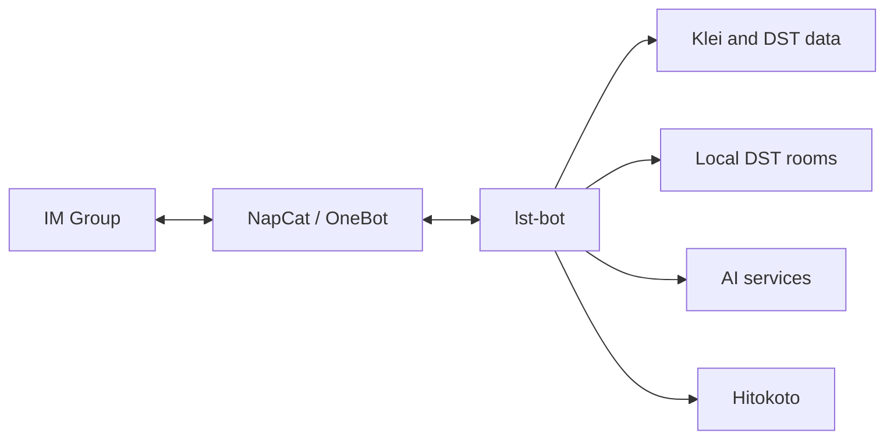

# lst-bot

English | [简体中文](README.zh-Hans.md)

`lst-bot` is the IM bot for **Let's Starve Together (LST)**, a *Don't Starve Together (DST)* player community.

This repository contains the bot application and its reusable framework and client packages.

## Features

- Connects LST group chats through OneBot.
- Looks up DST versions, Klei lobbies, room details, and online players.
- Manages local DST rooms and sends scheduled activity reports.
- Answers DST questions with an AI agent.

## Architecture

## Layout

- `src/lst_bot/` contains the application.
- `pkgs/` contains the bot framework and service clients.
- `systemd/` contains the deployment units.
- Tests live beside the code they cover.

## Configuration

The app reads `.env` from the repository root.

| Name | Purpose |
| --- | --- |
| `ONEBOT_WS_URL` | OneBot WebSocket URL |
| `ONEBOT_ACCESS_TOKEN` | OneBot access token |
| `ONEBOT_SELF_ID` | OneBot account ID |
| `BOT_ADMIN` | Admin account IDs |
| `BOT_CMD_PREFIXES` | Command prefixes |
| `BOT_TIMEOUT` | Event handling timeout as an ISO 8601 duration |
| `BOT_TIMEZONE` | Scheduler timezone |
| `REPORT_GROUP_ID` | Group for scheduled reports |
| `KLEI_ACCESS_TOKEN` | Klei access token |
| `KLEI_HOST_ID` | Managed DST host ID |
| `OPENROUTER_API_KEY` | AI provider credentials |
| `DOSU_MCP_ENDPOINT` | Knowledge service endpoint |
| `DOSU_API_KEY` | Knowledge service credentials |
| `HTTP_PROXY` | Proxy for outbound HTTP requests |
| `LOG_LEVEL` | Log level |

## Development

- `just sync` installs the workspace and development hooks.
- `just dev` starts the bot.
- `just check` runs CI checks.
- `just test` runs all checks and tests.
- `just build` checks and builds the project.

## Deployment

The supplied systemd units use `/srv/lst-bot` and `/srv/napcat`.

`systemd/napcat.container` runs NapCat with Podman, and `systemd/lst-bot.service` starts the bot after it.

1. Place the repository at `/srv/lst-bot` and run `just sync`.
2. Configure `.env`.
3. Enable the NapCat container and bot service.
4. For room management, provide `dst@<room>.service` units and grant the bot permission to control them.

Update the systemd units if the deployment paths differ.
