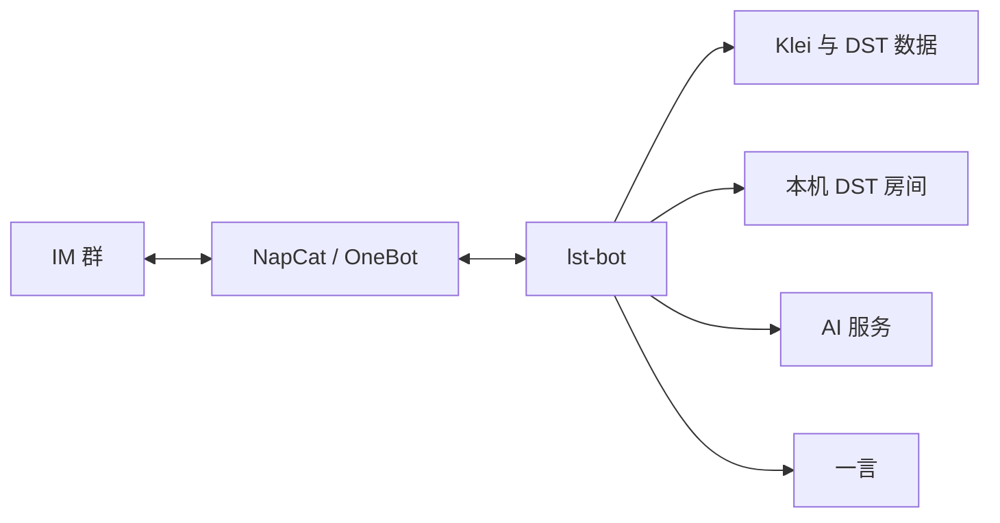

# lst-bot

[English](README.md) | 简体中文

`lst-bot` 是 **Let's Starve Together（LST）** 玩家群体使用的即时通讯机器人，服务于《饥荒联机版》（Don't Starve Together，DST）玩家。

本仓库包含机器人应用及其可复用框架和客户端包。

## 功能

- 通过 OneBot 接入 LST 群聊。
- 查询 DST 最新版本、Klei 大厅、房间详情和在线玩家。
- 管理本机 DST 房间并发送定时活跃报告。
- 使用 AI 助手回答 DST 问题。

## 架构

## 目录

- `src/lst_bot/` 包含机器人应用。
- `pkgs/` 包含 bot 框架和服务客户端。
- `systemd/` 包含部署单元。
- 测试放在其覆盖的代码旁边。

## 配置

应用从仓库根目录读取 `.env`。

| 变量 | 用途 |
| --- | --- |
| `ONEBOT_WS_URL` | OneBot WebSocket 地址 |
| `ONEBOT_ACCESS_TOKEN` | OneBot 访问令牌 |
| `BOT_ADMIN` | 管理员账号 ID |
| `BOT_CMD_PREFIXES` | 命令前缀 |
| `REPORT_GROUP_ID` | 定时报告群 |
| `KLEI_ACCESS_TOKEN` | Klei 访问令牌 |
| `KLEI_HOST_ID` | 托管的 DST 主机 ID |
| `OPENROUTER_API_KEY` | AI 服务凭据 |
| `DOSU_MCP_ENDPOINT` | 知识服务地址 |
| `DOSU_API_KEY` | 知识服务凭据 |
| `HTTP_PROXY` | 外部请求代理 |
| `LOG_LEVEL` | 日志等级 |

## 开发

- `just sync` 安装 workspace 和开发 hooks。
- `just dev` 启动机器人。
- `just check` 运行 CI 检查。
- `just test` 运行全部检查和测试。
- `just build` 检查并构建项目。

## 部署

仓库提供的 systemd 单元使用 `/srv/lst-bot` 和 `/srv/napcat`。

`systemd/napcat.container` 使用 Podman 运行 NapCat，`systemd/lst-bot.service` 随后启动机器人。

1. 项目位于 `/srv/lst-bot`，并已运行 `just sync`。
2. 配置 `.env`。
3. 启用 NapCat 容器和机器人服务。
4. 需要房间管理时，提供 `dst@<room>.service` 单元并授予机器人控制权限。

如果部署路径不同，请同步修改 systemd 单元。
