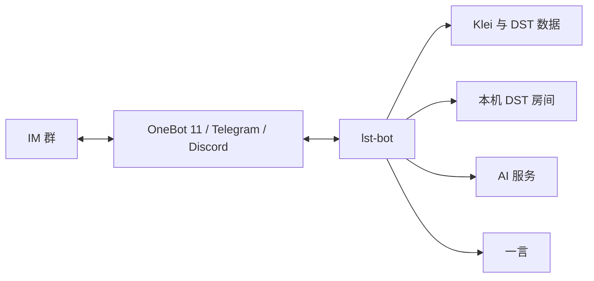

# lst-bot

[](https://steamcommunity.com/groups/lst99)
[](https://discord.gg/4N3aeNsFt8)

[English](README.md) | 简体中文


`lst-bot` 是 **Let's Starve Together（LST）** 玩家群体使用的即时通讯机器人，服务于《饥荒联机版》（Don't Starve Together，DST）玩家。

本仓库包含机器人应用及其可复用框架和客户端包。

## 功能

- 通过 OneBot 11、Telegram 和 Discord 接入聊天平台。
- 查询 DST 最新版本、Klei 大厅和房间详情。
- 管理本机 DST 房间并发送定时活跃报告。
- 使用 AI 助手回答 DST 问题。

房间管理使用部署目录中的完整编号，保留前导零，例如 `/房间存档 000,020,100`。
`/房间回档 020 2` 表示回退两个存档点；重启、重置使用相同的编号列表格式。
成功回复表示请求已发送，实际执行结果需在房间中确认。

## 架构



## 目录

- `src/lst_bot/` 包含机器人应用。
- `pkgs/` 包含 bot 框架和服务客户端。
- `systemd/` 包含部署单元。
- 测试放在其覆盖的代码旁边。

所有 HTTP 集成统一使用 HTTPX2；可复用客户端和网关通过 `http_client: httpx2.AsyncClient` 接收外部管理的客户端。
资源归属、超时、响应大小限制和 MCP 接入见 [HTTP 客户端设计](docs/http-client.md)。

## 配置

应用从当前工作目录读取 `.env`；文档中的命令和服务均从仓库根目录运行。

| 变量 | 用途 |
| --- | --- |
| `ONEBOT_WS_URL` | OneBot 11 WebSocket 地址 |
| `ONEBOT_ACCESS_TOKEN` | OneBot 11 访问令牌 |
| `ONEBOT_SELF_ID` | OneBot 11 账号 ID |
| `TELEGRAM_BOT_TOKEN` | Telegram Bot API 令牌；留空即禁用 Telegram |
| `DISCORD_BOT_TOKEN` | Discord Bot 令牌；留空即禁用 Discord |
| `DISCORD_INTENTS` | Discord Gateway intents 位字段；默认 `4609` |
| `BOT_ADMIN` | 按平台分组的管理员 ID，例如 `{"qq":["123"]}` |
| `BOT_CMD_PREFIXES` | 命令前缀 |
| `BOT_TIMEOUT` | ISO 8601 duration 格式的事件处理超时 |
| `BOT_TIMEZONE` | 定时任务时区 |
| `REPORT_GROUP_ID` | OneBot 11 定时报告群；留空即禁用定时报告 |
| `KLEI_ACCESS_TOKEN` | Klei 访问令牌 |
| `KLEI_HOST_ID` | 托管的 DST 主机 ID |
| `OPENROUTER_API_KEY` | 必填的 AI 服务凭据 |
| `DOSU_MCP_ENDPOINT` | 必填的 HTTPS 知识服务地址 |
| `DOSU_API_KEY` | 必填的知识服务凭据 |
| `HTTP_PROXY` | 外部服务和 Telegram/Discord 流量使用的 HTTP 代理（包括 Discord Gateway）；留空即直连 |
| `LOG_LEVEL` | 日志等级 |

`ONEBOT_WS_URL` 与 `ONEBOT_SELF_ID` 必须同时设置；两者均留空即禁用 OneBot 11。

Telegram Bot API 没有 WebSocket 事件传输，因此 Telegram 使用官方 `getUpdates` 长轮询接收事件。

Discord 使用 WebSocket Gateway。
请在 Discord Developer Portal 启用配置中涉及的 privileged intents；读取普通服务器消息正文需要 `MESSAGE_CONTENT`（在默认值上使用 `DISCORD_INTENTS=37377`）。

## 平台 API

可复用的 `bot` 框架支持官方 QQ Bot API，但 `lst-bot` 应用没有配置该 Gateway。

Telegram 以官方方法名开放 Bot API，但会保留与长轮询冲突的 `getUpdates` 和 `setWebhook`。

Discord 除通用机器人动作外，还开放 `discord.request` 和 `discord.gateway`；用户 OAuth、语音传输和多进程分片协调不在支持范围内。
单个 `DiscordGateway` 只负责一个 shard；达到 Discord 强制大规模分片门槛的机器人需要外部分片协调器。

## 开发

- `just sync` 安装 workspace 和开发 hooks。
- `just dev` 启动机器人。
- `just check` 运行 CI 检查。
- `just test` 格式化、检查代码、执行类型检查并运行测试套件。
- `just build` 检查并构建项目。

## 部署

仓库提供的文件定义了位于 `/srv/lst-bot` 的 rootful system 部署，可选的 NapCat 数据位于 `/srv/napcat`。
机器人以锁定的 `lst-bot` 用户运行；该用户仅拥有 `/srv/lst-bot/.cache`，并通过仓库提供的 polkit 规则启动、停止或重启已有的 `dst@*.service` 单元。

将仓库放在 `/srv/lst-bot`，配置 `.env`，然后在仓库根目录运行：

```sh
sudo chmod 0600 /srv/lst-bot/.env
sudo chown -R root:root /srv/lst-bot
sudo uv sync --locked --no-dev
sudo ln -sfn /srv/lst-bot/systemd/lst-bot.sysusers /etc/sysusers.d/lst-bot.conf
sudo ln -sfn /srv/lst-bot/systemd/lst-bot.tmpfiles /etc/tmpfiles.d/lst-bot.conf
sudo ln -sfn /srv/lst-bot/systemd/lst-bot.service /etc/systemd/system/lst-bot.service
sudo systemd-sysusers /etc/sysusers.d/lst-bot.conf
sudo systemd-tmpfiles --create /etc/tmpfiles.d/lst-bot.conf
sudo chown root:lst-bot /srv/lst-bot/.env
sudo chmod 0640 /srv/lst-bot/.env
sudo systemctl daemon-reload
sudo systemctl enable --now lst-bot.service
```

房间重启需要安装 polkit，并由管理员提供 `dst@<room>.service` 单元。
该规则不允许创建、启用或修改单元。

```sh
sudo ln -sfn /srv/lst-bot/systemd/lst-bot.rules /etc/polkit-1/rules.d/00-lst-bot.rules
```

存档、回档和重置通过 `/srv/dst/<room>/console` FIFO 发送命令。
运行房间服务后，须给 `lst-bot` 用户授予对应 FIFO 的写权限；例如安装 ACL 工具后，为房间 `020` 执行：

```sh
sudo setfacl -m u:lst-bot:w /srv/dst/020/console
```

父目录也需要允许该用户遍历。
如果房间服务会重新创建 FIFO，应在其创建流程中重新设置此权限。
没有读端、权限不足或管道已满时，命令会立即失败，不会创建普通文件代替 FIFO。

启用 OneBot 11 时，安装 rootful Quadlet，并在启动前收紧已有 NapCat 数据的权限：

```sh
sudo install -d -m 0700 /srv/napcat /srv/napcat/config /srv/napcat/ntqq
sudo chmod -R go-rwx /srv/napcat
sudo install -d -m 0755 /etc/containers/systemd
sudo ln -sfn /srv/lst-bot/systemd/napcat.container /etc/containers/systemd/napcat.container
sudo systemctl daemon-reload
sudo systemctl start napcat.service
```

不要执行 `systemctl enable napcat.service`；Quadlet 会在生成瞬态服务时应用其 `[Install]` 配置。
请让 NapCat 的 OneBot 11 WebSocket 服务监听 `0.0.0.0:3001`，设置 `ONEBOT_WS_URL=ws://127.0.0.1:3001`，并确保其 token 与 `ONEBOT_ACCESS_TOKEN` 一致。

更新现有部署时，请先停止机器人、更新由 root 所有的工作树，然后重复执行上方适用的安装命令。

```sh
sudo systemctl stop lst-bot.service
sudo git -C /srv/lst-bot pull --ff-only
```

最后的 `enable --now` 会重新启动机器人；Quadlet 发生变化后还需重启 NapCat。
NapCat 仅进行人工更新：

```sh
sudo podman pull docker.io/mlikiowa/napcat-docker:latest
sudo systemctl restart napcat.service
```

如果部署根目录不同，请同步修改仓库提供的所有文件与命令中的路径。
