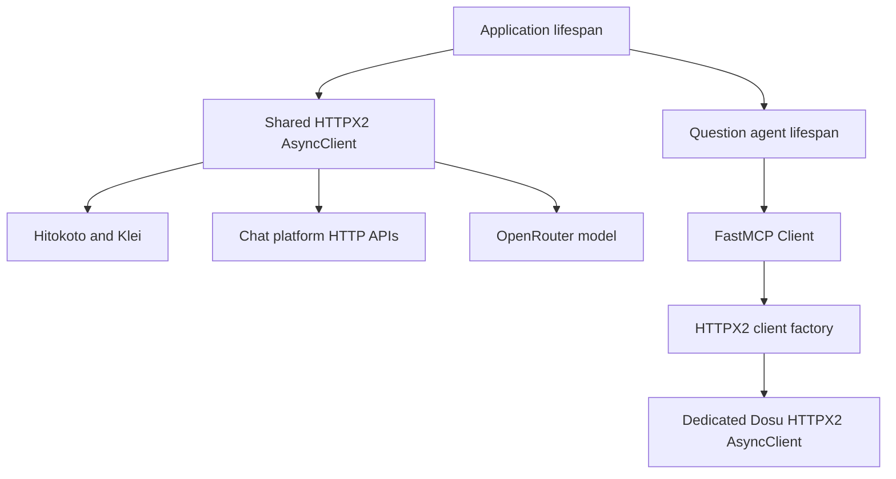

# HTTP clients

All application and package HTTP requests use `httpx2.AsyncClient`.
The dependency graph also uses HTTPX2 throughout, including OpenRouter, FastMCP, and the MCP SDK.
Reusable packages accept a required `http_client` argument and borrow that client without closing it.
There is no separate HTTP client interface, compatibility adapter, or transport wrapper.

The application opens the shared client before its borrowers and closes it after them.
Bot shutdown drains gateway work, and Hitokoto shutdown drains its detached cache refresh before the shared client closes.
FastMCP creates and closes a dedicated HTTP client for each connection through its native transport factory.
That factory keeps Dosu credentials scoped to the knowledge service and supports opening a new session after the previous client has closed.
This follows the native ownership contracts in the [HTTPX2 async guide](https://pydantic.dev/docs/httpx2/guides/async/) and [FastMCP transport documentation](https://gofastmcp.com/clients/transports).

The application and Dosu clients enable HTTP/2 with HTTP/1.1 fallback, retain TLS certificate verification, use the configured proxy, disable environment-derived proxy settings, and disable automatic redirects.
HTTPX2 uses the operating system trust store by default.
HTTP/3 is not part of the new transport stack.
See the official [HTTP/2](https://pydantic.dev/docs/httpx2/guides/http2/), [TLS](https://pydantic.dev/docs/httpx2/advanced/ssl/), and [proxy](https://pydantic.dev/docs/httpx2/advanced/proxies/) documentation.

HTTP timeouts and operation deadlines serve different purposes.
The shared client defaults to 600 seconds for read, write, and pool waits, with a 5-second connection timeout; model requests use those settings.
Each business request supplies its own timeout, and existing `asyncio.timeout` scopes continue to bound complete operations or batches.
Hitokoto retains its 120-second bundle-refresh deadline; Klei retains its 30-second operation deadline.
Telegram long polling allows the configured poll duration plus its transport margin.
Dosu uses a 600-second HTTP/MCP response budget and a 5-second HTTP connection timeout.
HTTPX2's [timeout documentation](https://pydantic.dev/docs/httpx2/advanced/timeouts/) describes the individual network phases; these are not whole-operation deadlines.

Business responses are streamed and checked against their limits before each chunk is appended.
The usual ceiling is 16 MiB of decoded content, so compressed responses cannot bypass the body limit.
Telegram file downloads instead retain their raw-byte semantics and configurable limit, which defaults to 20 MiB.
The library performs content decoding; application code does not implement gzip or other decoders.
Reading and closing run under cancellation control because HTTPX2 can begin closing inside its response iterator.
Cancellation stops an active reader once and waits for its cleanup, including when another cancellation arrives during shutdown.

Multipart requests use native `data` and `files` arguments, preserving platform field names, filenames, MIME types, and attachment references.
Transport retries remain disabled by default; platform-specific rate-limit and authentication handling stays in the corresponding gateway.
See the native [multipart API](https://pydantic.dev/docs/httpx2/advanced/clients/#multipart-file-encoding) and [transport retry semantics](https://pydantic.dev/docs/httpx2/advanced/transports/).
The application limits the `httpx2` logger to warning or higher because informational request logs contain full URLs, including Telegram and Discord credentials embedded in paths.

The question agent uses FastMCP's native client to discover and call `read_knowledge`.
Only that tool is registered, using its advertised description and input schema through Pydantic AI's `Tool.from_schema`.
The `jsonschema` library validates arguments before a remote request, since `Tool.from_schema` does not perform schema validation itself.
Structured results, including empty objects, take precedence; otherwise text and other content blocks are preserved.
Tool errors become `ModelRetry` feedback with their returned details, and missing tools or invalid schemas fail during startup while releasing the connection.
The implementation uses the public [Pydantic tool schema API](https://pydantic.dev/docs/ai/tools-toolsets/tools-advanced/#custom-tool-schema) and [FastMCP tool API](https://gofastmcp.com/clients/tools), without importing Pydantic AI's separate MCP integration module.

HTTP boundary tests use real HTTPX2 clients, requests, responses, and `MockTransport`, plus small `AsyncByteStream` implementations for cancellation and body limits.
OneBot also retains a local HTTP server for real transport coverage.
MCP tests exercise discovery, initialization, tool listing, calls, schema validation, and connection teardown through the official SDK stack.
Run `uv run --locked pytest`, the Ruff and type checks, and `uv build --all-packages --no-create-gitignore --no-sources` to verify the migration contracts.
